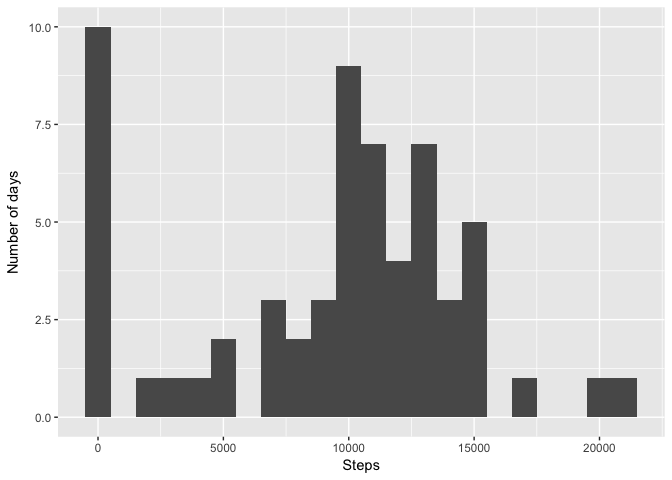
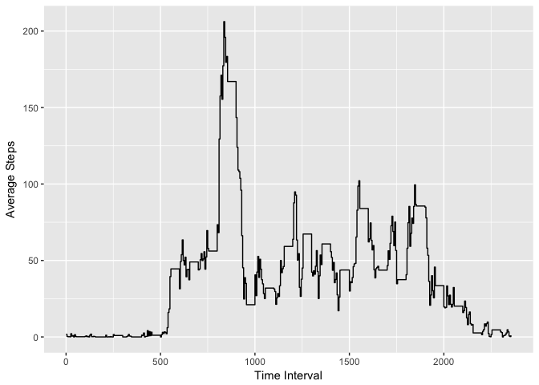
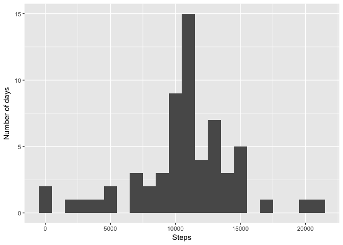
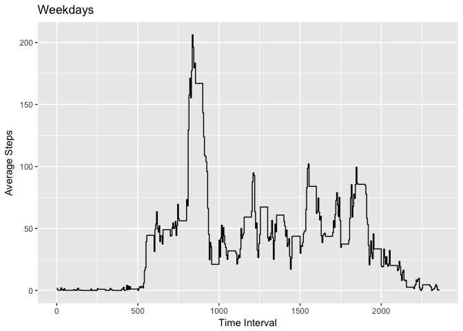
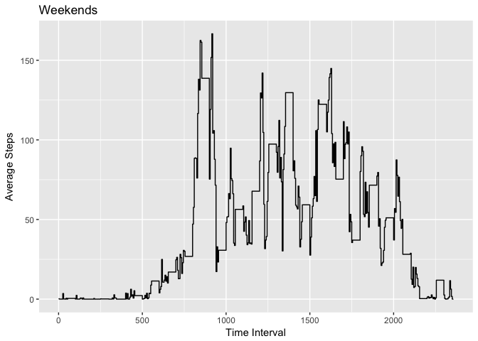

# Reproducible Research: Peer Assessment 1


#Introduction
This code will use data from a personal activity monitor, more specifically the step counter data. The data will be imported, processed, cleaned, and plotted in individual steps.

##Data Import


```r
library(ggplot2)
unzip('activity.zip')
raw_data <- read.csv("activity.csv")
```
This code block unzips the .zip file and reads the csv into memory.

##Cleaning data
Let's use strptime to clean up the dates:

```r
raw_data[, 2] <- as.Date(raw_data[, 2], format = "%Y-%m-%d")
summed_steps <- aggregate(raw_data$steps, by=list(raw_data$date), sum, na.rm=TRUE)
names(summed_steps) <- c("Date","Steps")
```

##Histogram of steps


And now let's plot it!


```r
library(ggplot2)
qplot(x=summed_steps$Steps,geom="histogram",binwidth=1000,xlab="Steps",ylab="Number of days")
```

<!-- -->

##Average and median


```r
averagebyday <- round(mean(summed_steps[,2], na.rm = TRUE))
medianbyday <- median(summed_steps[,2], na.rm = TRUE)
```
The average is 9354 and the median is 10395.

##What are the common times to take steps?
Let's use the five minute intervals in the raw data and look at when the subject is normally moving:

```r
mean_int <- aggregate(raw_data$steps, by=list(raw_data$interval), mean, na.rm=TRUE)
names(mean_int) <- c("interval", 'steps')
qplot(data=mean_int,x=interval,y=steps, geom="step", xlab="Time Interval", ylab="Average Steps")
```

<!-- -->

##Missing data
Unfortunately, there are a relatively high number of NA values in the original data:

```r
num_NA <- sum(is.na(raw_data))
```
There are  NA values in the raw data. One way to do this would be to use the average computed value from all days for any given interval. We can do this with the following code:


```r
StepsAverage <- aggregate(steps ~ interval, data = raw_data, mean)
fillNA <- numeric()
for (i in 1:nrow(raw_data)) {
    obs <- raw_data[i, ]
    if (is.na(obs$steps)) {
        steps <- subset(StepsAverage, interval == obs$interval)$steps
    } else {
        steps <- obs$steps
    }
    fillNA <- c(fillNA, steps)
}

# Create a new DF with the filled NA values
clean_data <- raw_data
clean_data$steps <- fillNA
```

Let's remake our histogram from before with the new data:

```r
summed_noNa <- aggregate(clean_data$steps, by=list(clean_data$date), sum)
names(summed_noNa) <- c("Date","Steps")
qplot(x=summed_noNa$Steps,geom="histogram",binwidth=1000,xlab="Steps",ylab="Number of days")
```

<!-- -->

And let's recalculate the mean and median to see if they change:

```r
averagenona <- round(mean(summed_noNa[,2]))
mediannona <- median(summed_noNa[,2])
```
Which are now 1.0766\times 10^{4} and 1.0766189\times 10^{4}.

## Weekdays versus weekends
Now let's see if there is a difference in activity between weekdays and weekends. We can use the weekdays() function to subset the data:


```r
clean_data$day <- as.POSIXlt(clean_data$date)$wday
weekdays <- subset(clean_data, day = 1:5)
weekends <- subset(clean_data, day == 0 | day == 6)
```
Now that we have our weekend and weekdays data frames, we can run our time series as before:

```r
weekdays_int <- aggregate(weekdays$steps, by=list(weekdays$interval), mean)
names(weekdays_int) <- c("interval", 'steps')
qplot(data=weekdays_int,x=interval,y=steps, geom="step", xlab="Time Interval", ylab="Average Steps", main = "Weekdays")
```

<!-- -->

```r
weekends_int <- aggregate(weekends$steps, by=list(weekends$interval), mean)
names(weekends_int) <- c("interval", 'steps')
qplot(data=weekends_int,x=interval,y=steps, geom="step", xlab="Time Interval", ylab="Average Steps", main = "Weekends")
```

<!-- -->
